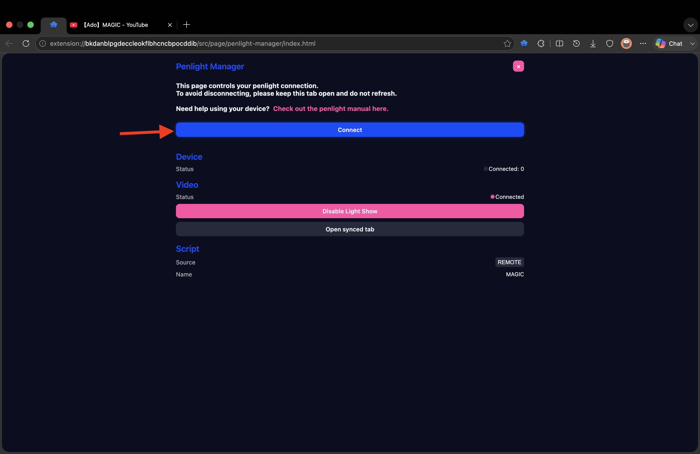
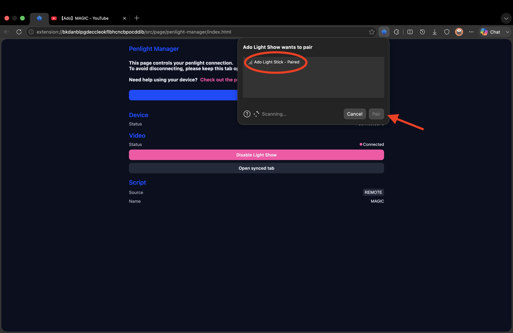
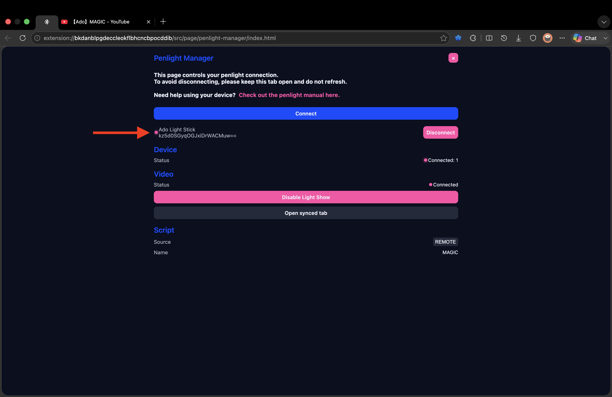

# How to use

Before you start, make sure you have the following things ready.

- Ado penlight device
- The [Ado Light Show extension](https://chromewebstore.google.com/detail/ado-light-show/neibdleiahnmlccpldgpimhibfmaalgh) downloaded on a machine that is able to connect with Bluetooth device

1. Navigate to a Youtube page, then click on the extension icon

2. Click on the **Enable Light Show** button to sync with the video on the current browser tab

3. Once you clicked on it, then video will be synced, and you should see the **Disable Light Show** button

4. Click on the **Penlight Manager** button to manage your penlight connections

5. Click on the **Connect** button to start the pairing process. (_This page will keep you penlight connected, make sure you don't close it, otherwise the penlight connection will drop and you will have to re-connect again_)

6. Find your **Ado Light Stick** and click **Pair**. (_Make sure your penlight is nearby and in pairing mode_)

7. Once you finished, the name and id of the penlight should appear.

8. After **syncing the video** and **connecting the penlight**, you can start enjoying the light show! 🎉💙🥀
