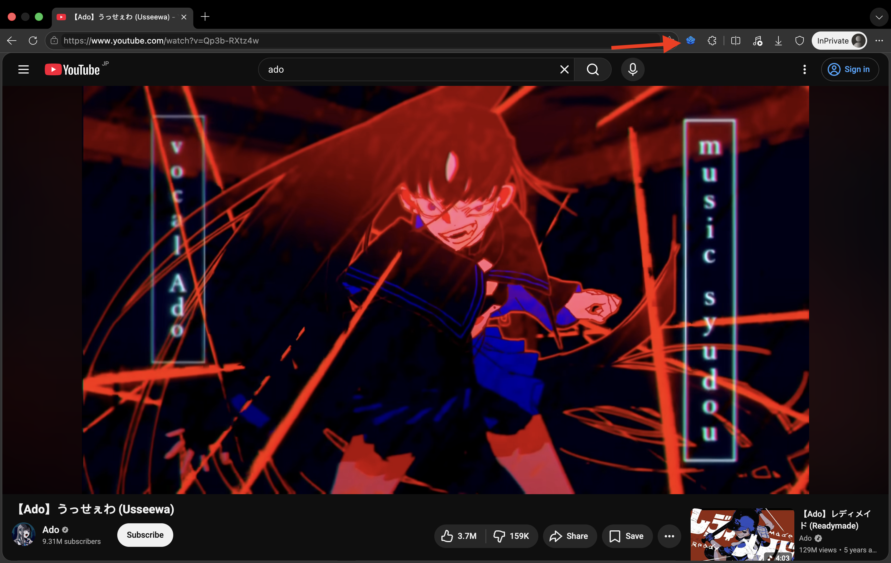
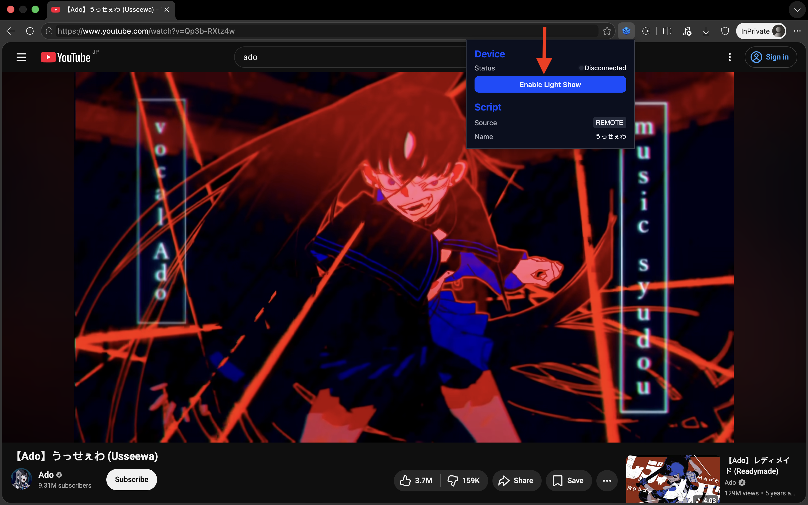
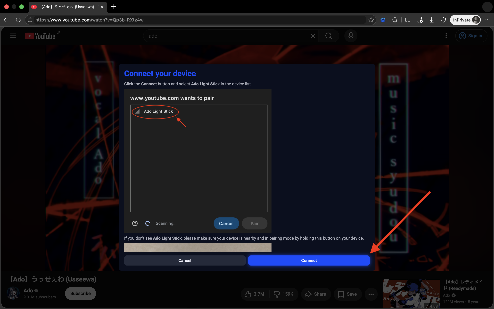
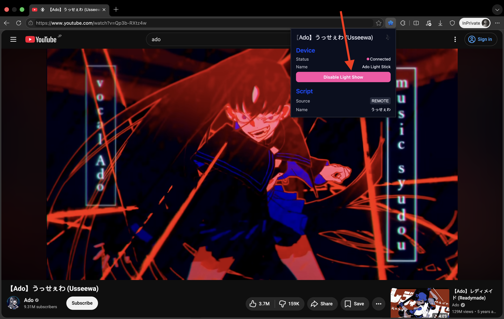

# How to use

Before you start, make sure you have the following things ready.

- Ado penlight device
- The [Ado Light Show extension](https://chromewebstore.google.com/detail/ado-light-show/neibdleiahnmlccpldgpimhibfmaalgh) downloaded on a machine that is able to connect with Bluetooth device

1. Navigate to a Youtube page, then click on the extension icon

2. Click on the "Enable Light Show" button to start the device pairing process

3. A modal will open to guide you on how to connect to your Ado penlight device. Click on the "Connect" button

4. After the device is connected, you should see the device status and the "Disable Light Show" button

